# Poppy-humanoid soldering tutorial

This tutorial explain step by step how to produce custom wire needed to your poppy-humanoid.

You will need:

- [Audio Jack connector](http://fr.farnell.com/webapp/wcs/stores/servlet/ProductDisplay?catalogId=15001&langId=-2&urlRequestType=Base&partNumber=1243268&storeId=10160)
- [Screw terminal connector 2P](http://fr.farnell.com/webapp/wcs/stores/servlet/ProductDisplay?catalogId=15001&langId=-2&urlRequestType=Base&partNumber=3041359&storeId=10160)
- [Screw terminal connector 4P](http://fr.farnell.com/webapp/wcs/stores/servlet/ProductDisplay?catalogId=15001&langId=-2&urlRequestType=Base&partNumber=3041414&storeId=10160)
- [Audio cable](http://fr.farnell.com/webapp/wcs/stores/servlet/ProductDisplay?catalogId=15001&langId=-2&urlRequestType=Base&partNumber=1218691&storeId=10160)
- [Large heat shrink](http://fr.farnell.com/webapp/wcs/stores/servlet/ProductDisplay?catalogId=15001&langId=-2&urlRequestType=Base&partNumber=1187634&storeId=10160)
- [Small heat shrink](http://fr.farnell.com/nte-electronics/47-23048-bk/heat-shrink-tubing-3mm-id-po-black/dp/2192424?aa=true&categoryId=700000006023)
- [Molex connector 4P](http://fr.farnell.com/webapp/wcs/stores/servlet/ProductDisplay?catalogId=15001&langId=-2&urlRequestType=Base&partNumber=9979565&storeId=10160)
- [Contact Crimping](http://fr.farnell.com/webapp/wcs/stores/servlet/ProductDisplay?catalogId=15001&langId=-2&urlRequestType=Base&partNumber=1462522&storeId=10160)
- [Black/red Cable](http://fr.farnell.com/pro-power/cb0043-red-black-100m/cable-2cond-0-44mm2-red-noir-par/dp/2425483)
- [Ubec](http://www.adafruit.com/product/1385)
- [Audio amplifier](http://www.adafruit.com/products/987)
- [Two speakers](http://fr.farnell.com/visaton/2941/loudspeaker-mini-oval-8-ohm/dp/1675524?ost=1675524)
- Electronique tools set

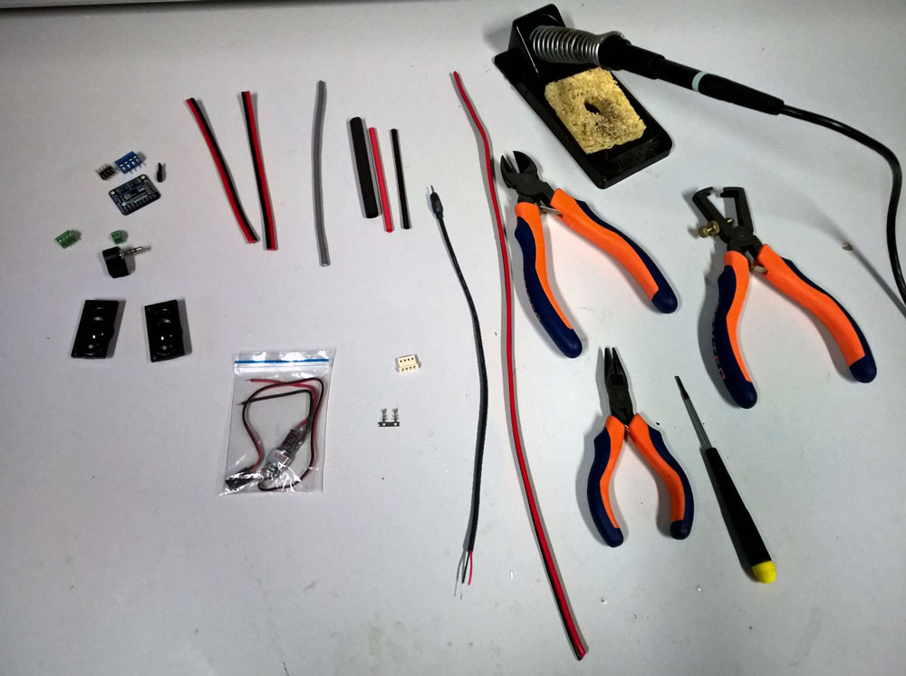

## Power Supply
You will need:
- 30cm of **Black/red cable**
- two **contact crimping**
- a **molex connector 4P**
- **Ubec**
- **Small heat shrink**
- **Large heat shrink**

1) Strip and foliate the 2 sides of your **Black/red cable**  
2) Crimp your **contact crimping**  
3) Put a small tin layer in your **contact crimping**
4) Place it in your **molex connector 4P**  
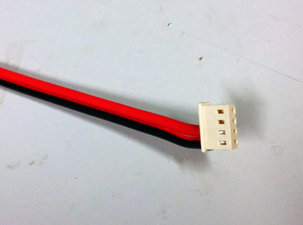  
5) Soldering the other side to the black and red cables of your **UBEC**. Do not forget to use 2 parts of **Small heat shrink** for each wire (black and red) and a **Large heat shrink** above.  

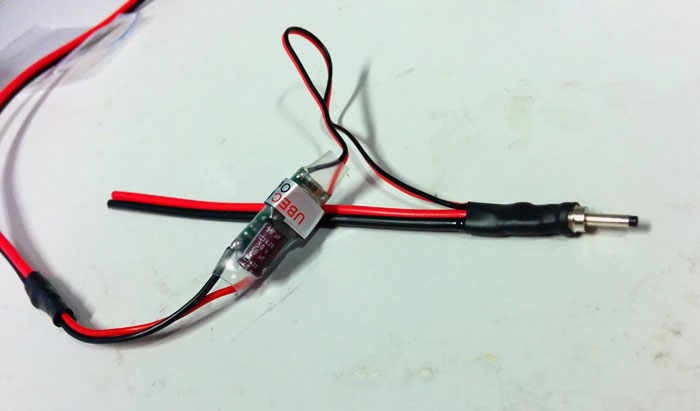

## Sound

### Build a cable with stereo jack
You will need:
- 10cm of **Audio cable**
- **Audio Jack connector**
- **Large heat shrink**
1) Strip and foliate the 2 sides of your **Audio cable**
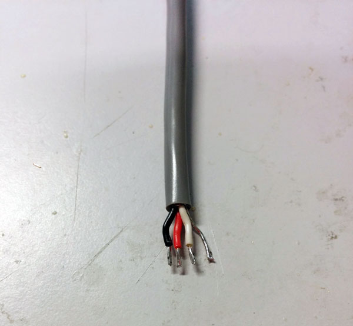  
2) Soldering the **Audio Jack connector**  
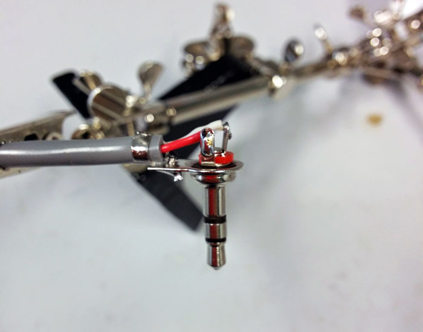  
3) Do not use the **Audio Jack connector** cover (it will be too big for Poppy). Bend left and right contact of **Audio Jack connector** and cover it with **Large heat shrink**.
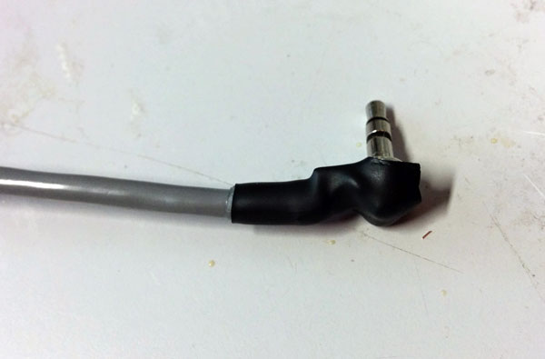

### Solder components on the Adafruit stereo amplifier
You will need:
- **Screw terminal connector 2P**
- **Screw terminal connector 4P**
- **Audio amplifier**

1) Cut the two plasic pin of the **Screw terminal connector 2P**
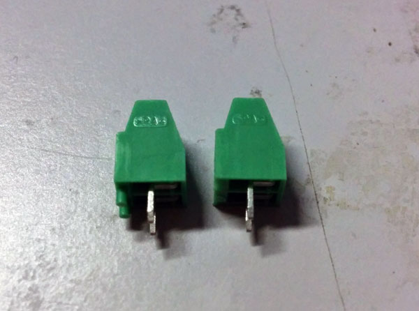  
2) Soldering Blue screw terminal and 2x4p header given with the **Audio amplifier** kit.  
3) Soldering **Screw terminal connector 2P** on *VDD* and *GND* pins.  
4) Soldering **Screw terminal connector 4P** on *L+*, *L-*, *R+*, and *R-* pins.  

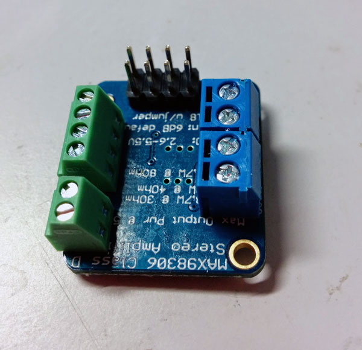
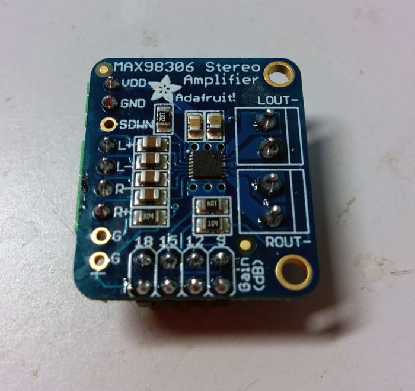

### Speakers
You will need:
- 2x15cm of **Black/red cable**
- **Two speakers**
- **Large heat shrink**  
1) Strip and foliate the 2 sides of your **Black/red cable**
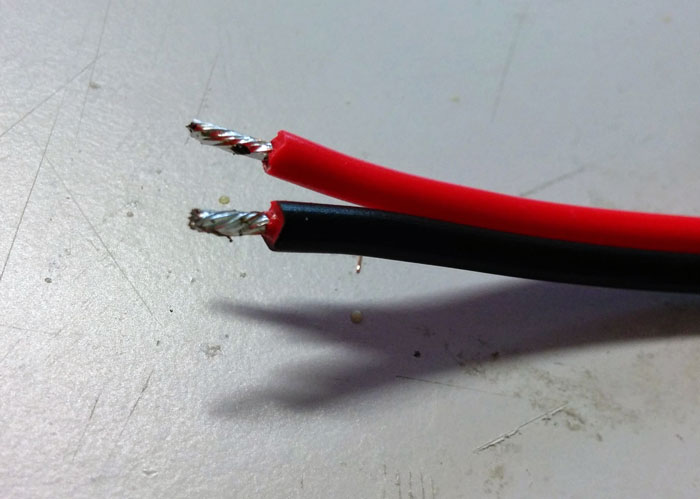  
2) Soldering it on your **Two speakers**  
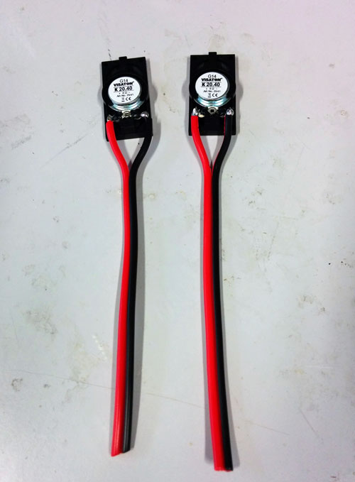
