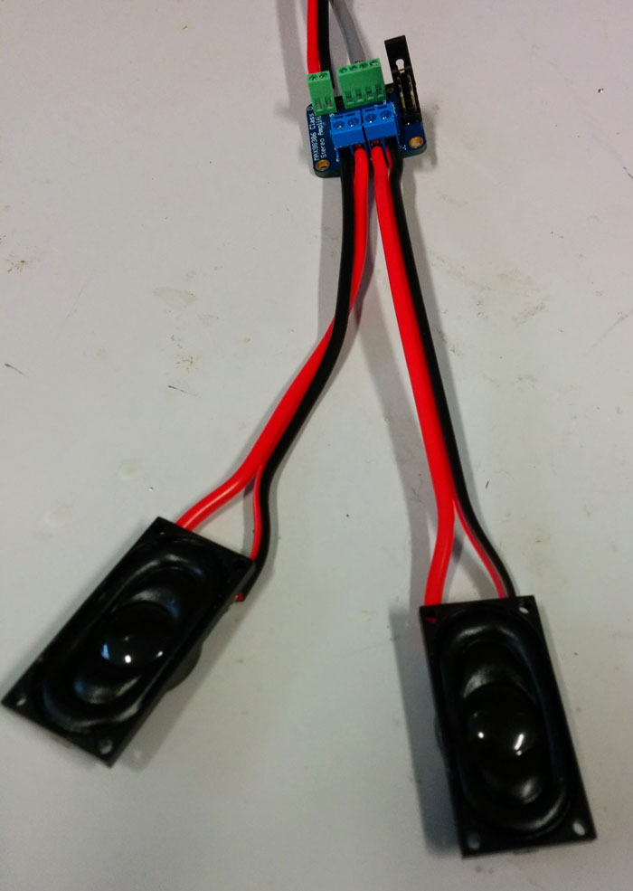

# Poppy-humanoid soldering tutorial

This tutorial explain step by step how to produce custom wire needed to your poppy-humanoid.

You will need:

- [Audio Jack connector](http://fr.farnell.com/webapp/wcs/stores/servlet/ProductDisplay?catalogId=15001&langId=-2&urlRequestType=Base&partNumber=1243268&storeId=10160)
- [Screw terminal connector 2P](http://fr.farnell.com/webapp/wcs/stores/servlet/ProductDisplay?catalogId=15001&langId=-2&urlRequestType=Base&partNumber=3041359&storeId=10160)
- [Screw terminal connector 4P](http://fr.farnell.com/webapp/wcs/stores/servlet/ProductDisplay?catalogId=15001&langId=-2&urlRequestType=Base&partNumber=3041414&storeId=10160)
- [Audio cable](http://fr.farnell.com/webapp/wcs/stores/servlet/ProductDisplay?catalogId=15001&langId=-2&urlRequestType=Base&partNumber=1218691&storeId=10160)
- [Large heat shrink](http://fr.farnell.com/webapp/wcs/stores/servlet/ProductDisplay?catalogId=15001&langId=-2&urlRequestType=Base&partNumber=1187634&storeId=10160)
- [Small heat shrink](http://fr.farnell.com/nte-electronics/47-23048-bk/heat-shrink-tubing-3mm-id-po-black/dp/2192424?aa=true&categoryId=700000006023)
- [Molex connector 4P](http://fr.farnell.com/webapp/wcs/stores/servlet/ProductDisplay?catalogId=15001&langId=-2&urlRequestType=Base&partNumber=9979565&storeId=10160)
- [Contact Crimping](http://fr.farnell.com/webapp/wcs/stores/servlet/ProductDisplay?catalogId=15001&langId=-2&urlRequestType=Base&partNumber=1462522&storeId=10160)
- [Black/red Cable](http://fr.farnell.com/pro-power/cb0043-red-black-100m/cable-2cond-0-44mm2-red-noir-par/dp/2425483)
- [Ubec](http://www.adafruit.com/product/1385)
- [Audio amplifier](http://www.adafruit.com/products/987)
- [Two speakers](http://fr.farnell.com/visaton/2941/loudspeaker-mini-oval-8-ohm/dp/1675524?ost=1675524)
- Electronique tools set

## Power Supply

## Sound

### Build a cable with stereo jack

### Solder components on the Adafruit stereo amplifier

### Speakers

