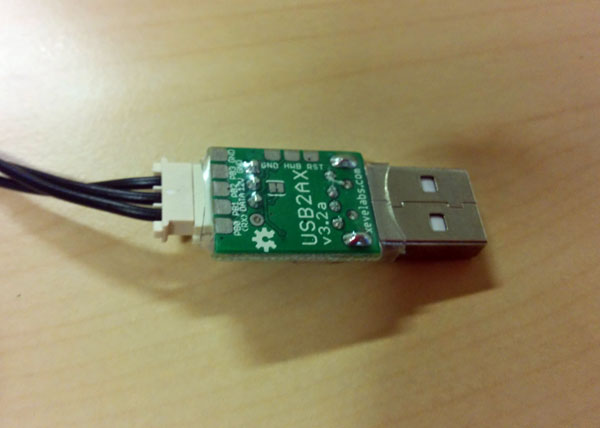
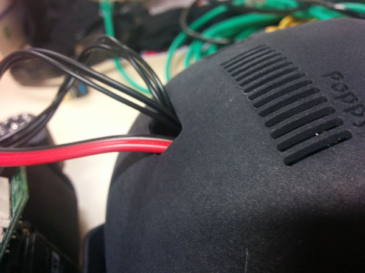
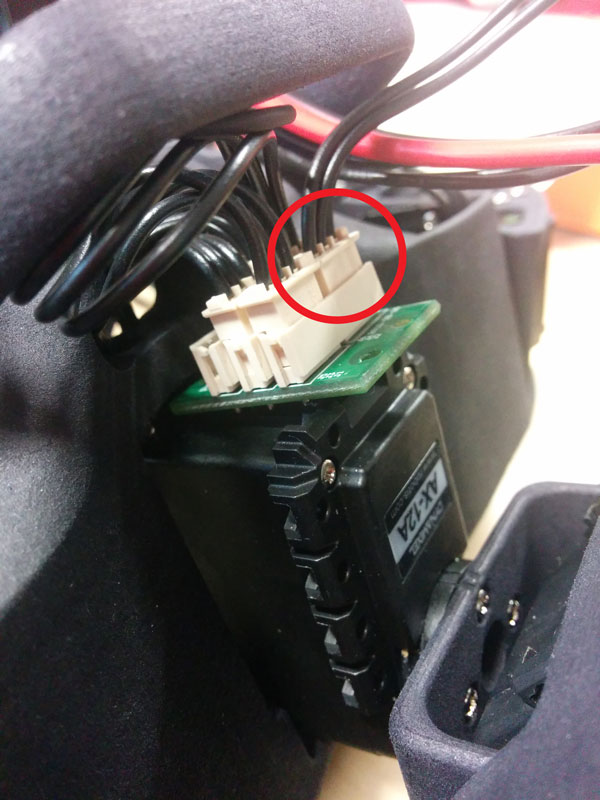
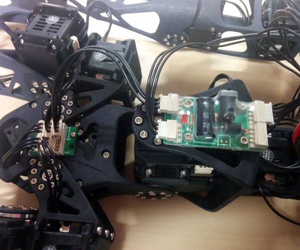
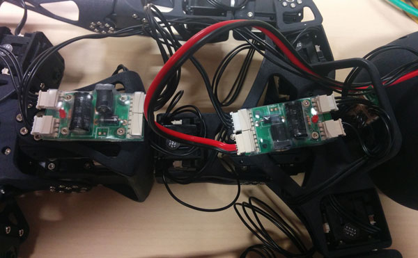
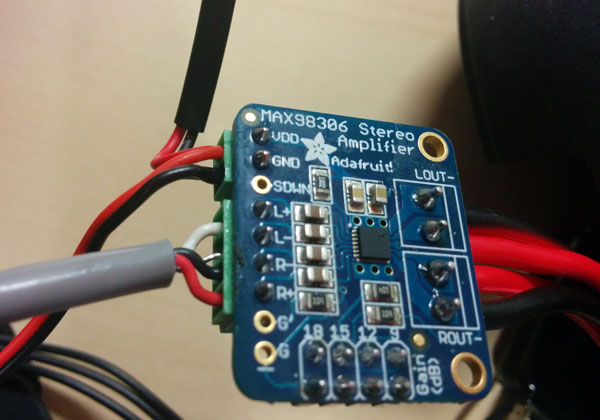
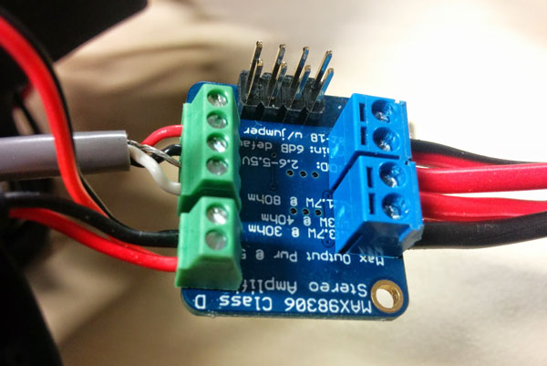
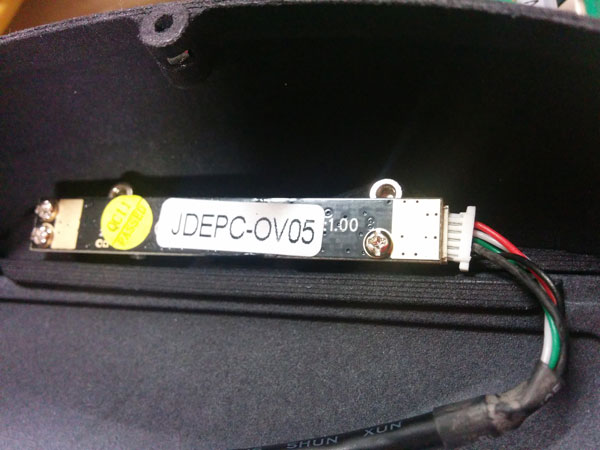

# Poppy-humanoid wiring tutorial

This tutorial explain step by step how to wire your poppy-humanoid head.

##Motor network
1) Take the two longest 3P robotis wire and plug it to your two USB2AX.  
  
2) Pass the other side into the hole back to the Poppy's head.  
  
3) Plug one in the robotis dispatcher into the neck.  
  
4) Plug the other into the power board into the pelvis.  
  

##Power and sound of the head
1) Take your custom UBEC and pass the black/red wire with the 4P robotis connector into the hole back to the Poppy's head.  
  
2) Plug the 4p robotis connector in one of the robotis power board.  
  
3) Put the other side of the UBEC and the odroid power jack on the 2P green screw terminal of your audio amplificator (red on VDD and black into GND).  
  
4) Put the odroid audio jack on the 4p green screw terminal of your audio amplifier like this :  
  
5) Add your speaker into blue screw terminal of your amplifier.  
  

##Final step
1) Connect the audio jack on your odroid.  
2) Mount your EMMC or SD memory card into your odroid.  
3) Set your odroid into the head.  
4) Plug your camera.  
  
4) Connect the power jack on your odroid.  
5) Connect a usb hub on your odroid.  
6) Plug all your usb devices (camera, 2xUSB2AX, wifi).  
7) Close the head.  

##Poppy software environement installation
Please folow the [Poppy software installation readme](https://github.com/poppy-project/poppy_install)
